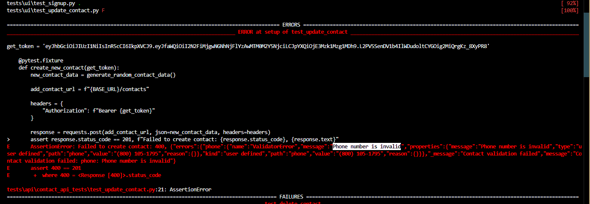

# Bug Report: Adding a correct format phone number results in a "Phone number is invalid" error

## Description

Another bug found by API automation: Even though we are creating a new contact with the same phone number format, example: "'(800) 697-5856'", the test fails sometimes, "message":"Phone number is invalid".
This is not consistent, though.

## Steps to Reproduce

1. execute an API test where i;s required t add a phone number (while adding a contact)
2. Create a new contact with the same phone number format, example: "'(800) 697-5856'"

## Expected Result

The contact is created successfully.

## Actual Result

Even though we are creating a new contact with the same phone number format, example: "'(800) 697-5856'", the test fails sometimes, "message":"Phone number is invalid".
This is not consistent, though.

## Attachments

### Screenshot

